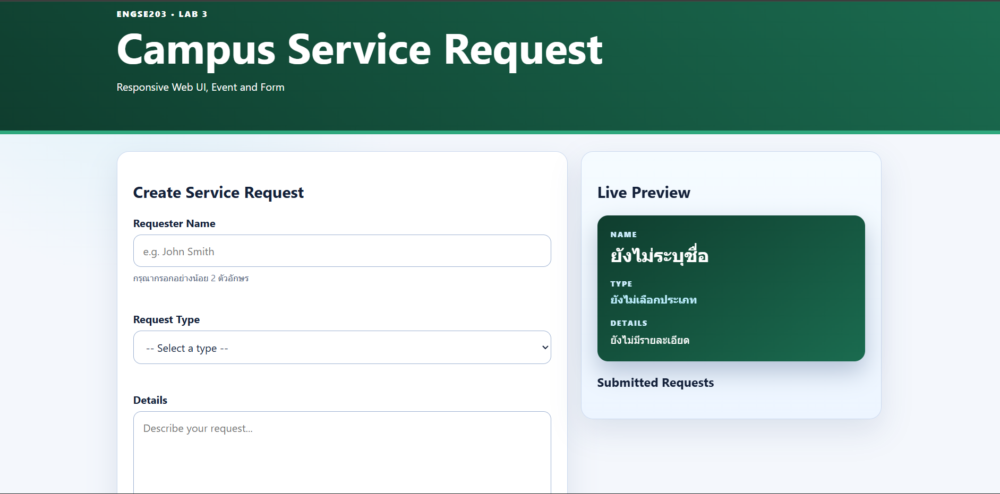
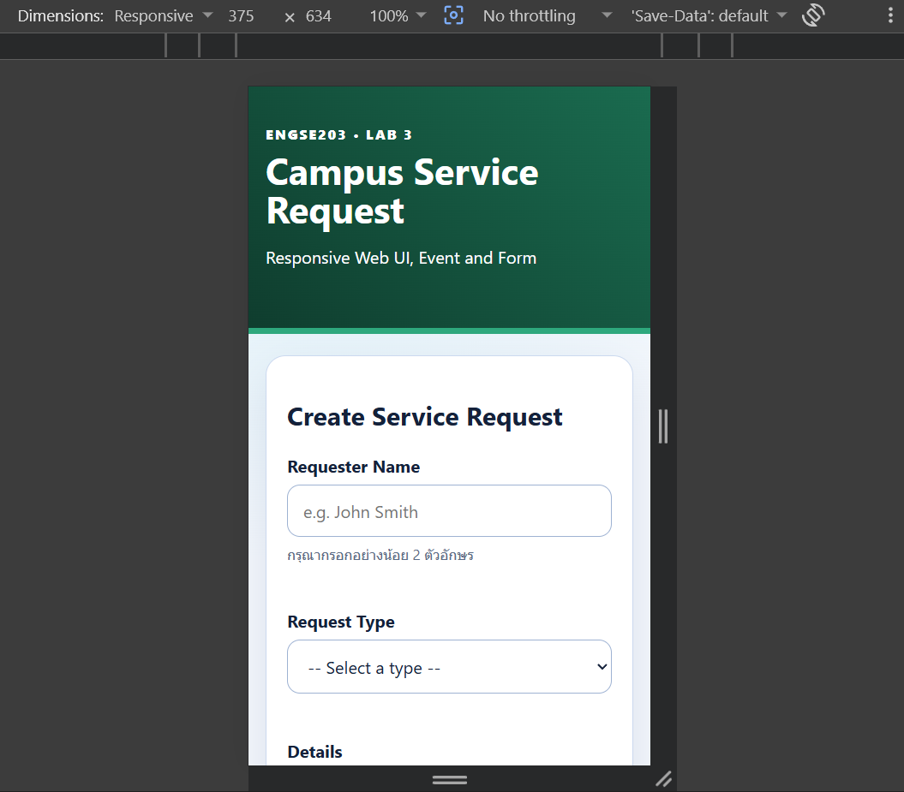
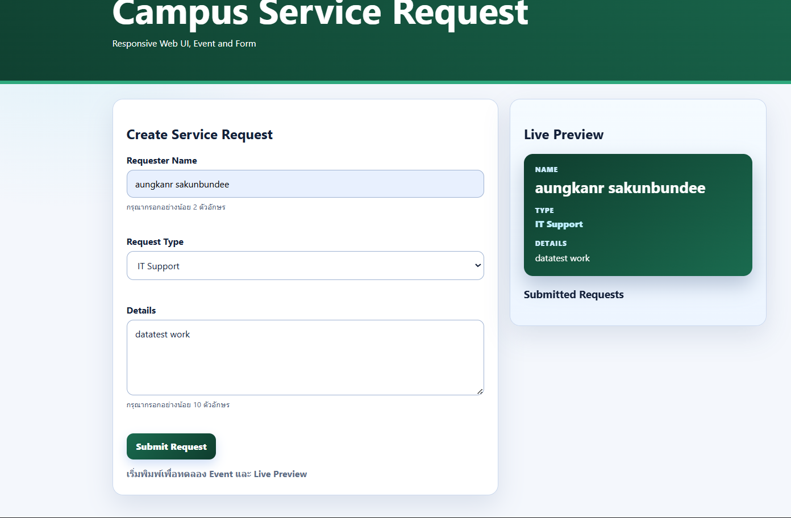

# ENGSE203 LAB 03 — Campus Service Request Form

## ผู้จัดทำ

- **ชื่อ-นามสกุล :** อังคาร สกุลบุญดี
- **รหัสนักศึกษา :** 68543210048
- **ระบบปฏิบัติการที่ใช้ :** Windows (WSL / Ubuntu)

## วัตถุประสงค์ของงาน

1. เพื่อพัฒนาแบบฟอร์มหน้าเว็บโดยใช้โครงสร้าง Semantic HTML และคำนึงถึง Accessibility (เช่น การใช้ label, aria-describedby)
2. เพื่อจัดรูปแบบหน้าเว็บให้เป็น Responsive Layout รองรับทั้งการแสดงผลบน Mobile (1 คอลัมน์) และ Desktop (2 คอลัมน์)
3. เพื่อเขียน JavaScript จัดการ Event (input, submit) สำหรับแสดงผล Live Preview ข้อมูลแบบเรียลไทม์
4. เพื่อทำ Form Validation แสดงสถานะข้อมูลที่ถูกต้องและไม่ถูกต้อง พร้อมข้อความแจ้งเตือนที่ชัดเจน
5. เพื่อฝึกทักษะการใช้งาน Git: การสร้าง Feature Branch, การทำ Commit Checkpoints, การทำ Pull Request และการ Deploy ขึ้น GitHub Pages

## เครื่องมือที่ใช้

- HTML5 / CSS3 / JavaScript
- Vite (Build Tool)
- Git & GitHub
- Visual Studio Code

## วิธีติดตั้งและรัน

```bash
npm install
npm run dev
```
```
โครงสร้างไฟล์

.
├── .vscode/             
├── docs/                # โฟลเดอร์ผลลัพธ์จากการ Build เพื่อใช้สำหรับ GitHub Pages
├── node_modules/        
├── prelab03/            # โฟลเดอร์เก็บไฟล์งาน Prelab
├── src/                 # โฟลเดอร์สำหรับเก็บไฟล์ Source Code
│   ├── main.js          # โค้ด JavaScript จัดการ Event และ Validation
│   └── style.css        # โค้ด CSS จัดการ Layout และปรับแต่งหน้าตา
├── .gitignore           
├── index.html           # ไฟล์ HTML หลัก ที่ไว้รันหน้าเว็บ
├── package-lock.json    
├── package.json         
├── README.md            
└── vite.config.js       # ไฟล์ตั้งค่า Vite สำหรับ GitHub Pages
```

 📸 หลักฐานผลลัพธ์ (Screenshots)

*(กรุณานำรูปภาพผลลัพธ์ของคุณไปใส่ไว้ในโฟลเดอร์ `img/` ก่อน แล้วแก้ไขชื่อไฟล์ในวงเล็บ `()` ด้านล่างให้ตรงกับชื่อรูปจริงของคุณนะครับ)*

### 1. หน้าเว็บแบบ Desktop และการทำ Live Preview
แสดงผลหน้าฟอร์มเต็มรูปแบบบนคอมพิวเตอร์ พร้อมแสดงข้อมูลในส่วน Live Preview


### 2. หน้าเว็บแบบ Mobile (Responsive Layout)
แสดงผลหน้าฟอร์มเมื่อเปิดผ่านมือถือ (ควรแสดงผลเป็น 1 คอลัมน์)


### 3. การตรวจสอบข้อมูล ( real time Live Preview )
แสดงตัวอย่างเมื่อกรอกข้อมูลผิด (Error State) และเมื่อกรอกข้อมูลครบถ้วน (Success State)


### 3. การตรวจสอบข้อมูล ( error )
แสดงตัวอย่างเมื่อกรอกข้อมูลผิด (Error State) และเมื่อกรอกข้อมูลครบถ้วน (Success State)

